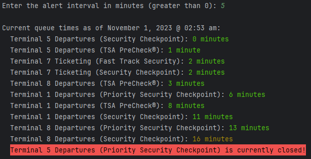

# Airport Queue Monitor

A Java program that grabs and outputs the current queue times for security checkpoints at the John F. Kennedy
International Airport.

# Why?

I had an upcoming trip with a connection through the John F. Kennedy International Airport and wanted to know how long
the security lines were. I looked around for information and found it on the official website showing the current queue
times, so I took a look at the outgoing requests, saw that it was a simple GET request to a JSON API, and decided to
make a program that would grab the queue times and output them at a specified interval because I had nothing else to do.

tl;dr: I was bored.

# Usage

To run the program, simply run the `main` method in `AirportQueueMonitor.java`. The program will output the current
queue times for each registered checkpoint in the airport at the specified interval.

## Example Output

### Disclaimer

I will not provide any support for this program. It is provided as-is and there is no guarantee that it will work or
will receive any updates.